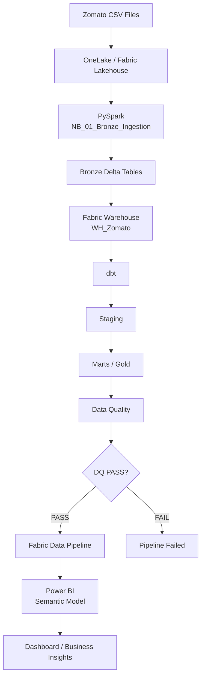

# Zomato Data Engineering Project

End-to-end Data Engineering project built with **Microsoft Fabric**.

## Architecture Flow



## Project Structure

```text
DE-Project/
│
├── 01_Lakehouse/
│   └── LH_Zomato_Bronze.Lakehouse/
│
├── 02_Notebooks/
│   ├── NB_01_Bronze_Ingestion.Notebook/
│   └── Bronze_DQ.Notebook/
│
├── 03_dbt/
│   └── DBT_Zomatov1.DataBuildToolJob/
│       └── Code/
│           └── dbt/
│               ├── models/
│               │   ├── staging/
│               │   ├── marts/
│               │   └── dq/
│               │
│               └── dbt_project.yml
│
├── 04_Pipeline/
│   └── PL_Zomato_Daily.DataPipeline/
│
├── 05_BI/
│   ├── SM_Zomato.SemanticModel/
│   └── Report.Report/
│
└── README.md
```


## Main Components

| Folder | Purpose |
|---|---|
| `01_Lakehouse/` | Bronze data storage |
| `02_Notebooks/` | PySpark ingestion and Data Quality |
| `03_dbt/` | Staging, Marts and DQ transformation |
| `04_Pipeline/` | Pipeline orchestration |
| `05_BI/` | Semantic Model and Power BI |

## Technology Stack

- Microsoft Fabric
- OneLake
- Lakehouse
- PySpark
- Fabric Warehouse
- dbt
- Fabric Data Factory
- Power BI
- Git / GitHub
